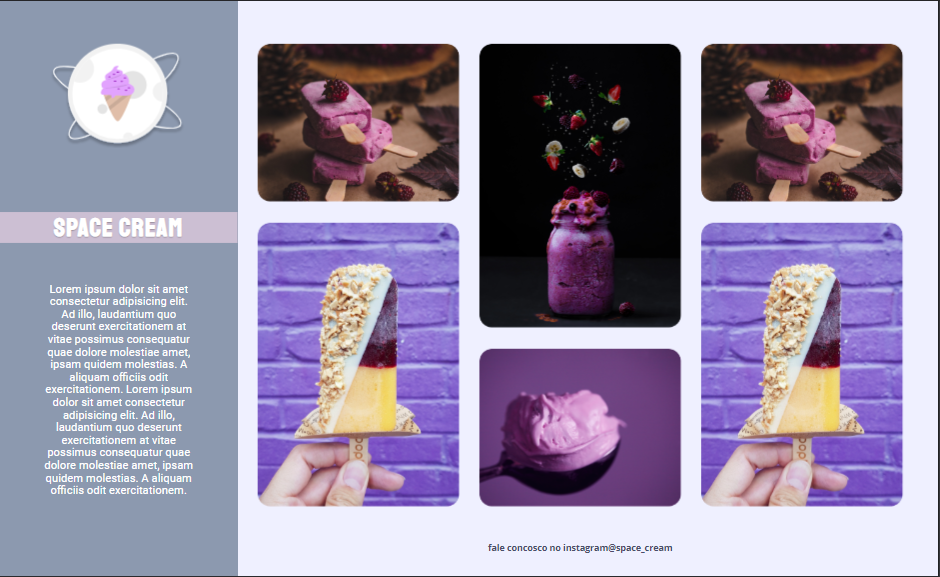

# <h1 align="center">Space Cream</h1>

Challenge Space Cream - Stage 03 Rockeseat Explorer course

  <a href="#-concepts">Worked concepts</a>&nbsp;&nbsp;&nbsp;|&nbsp;&nbsp;&nbsp;
  <a href="#-Technologies">Technologies</a>&nbsp;&nbsp;&nbsp;|&nbsp;&nbsp;&nbsp;
  <a href="#-Project Demonstration">Project Demonstration</a>&nbsp;&nbsp;&nbsp;|&nbsp;&nbsp;&nbsp;
  <a href="#-License">License</a>

  

## ✔ Worked concepts
- Mobile First
- Responsive Design
- Layout Grid
- Animations and transitions
- Media queries

## 🚀 Technologies

- HTML e CSS
- Git e Github
- Figma

## 💻 Project Demonstration

  You can preview the project layout [HERE](https://www.figma.com/file/gTTZCeqxE7zDvphsqR9Wpw/Stage-03---Grid-com-anima%C3%A7%C3%B5es-(Copy)?node-id=0-1&t=gCYu7bjU7JUezLQO-0). You must have an account at [Figma](https://figma.com) to access it.

  

## 📝 License

  

 
